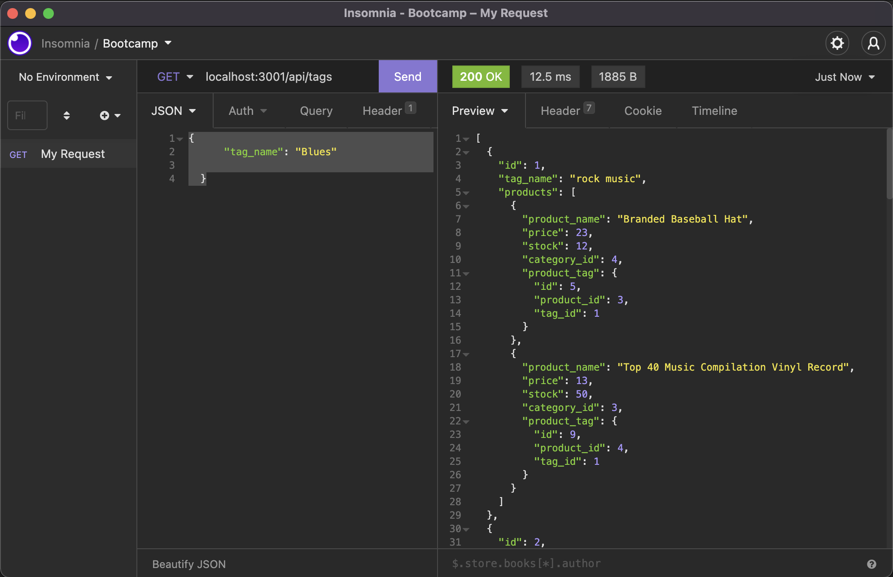
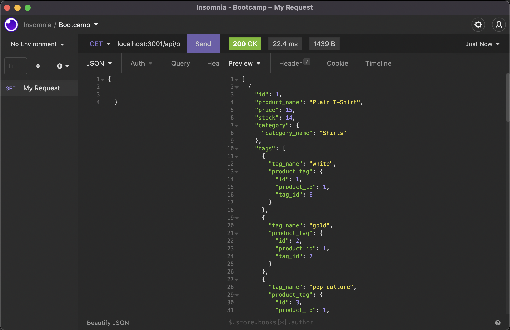
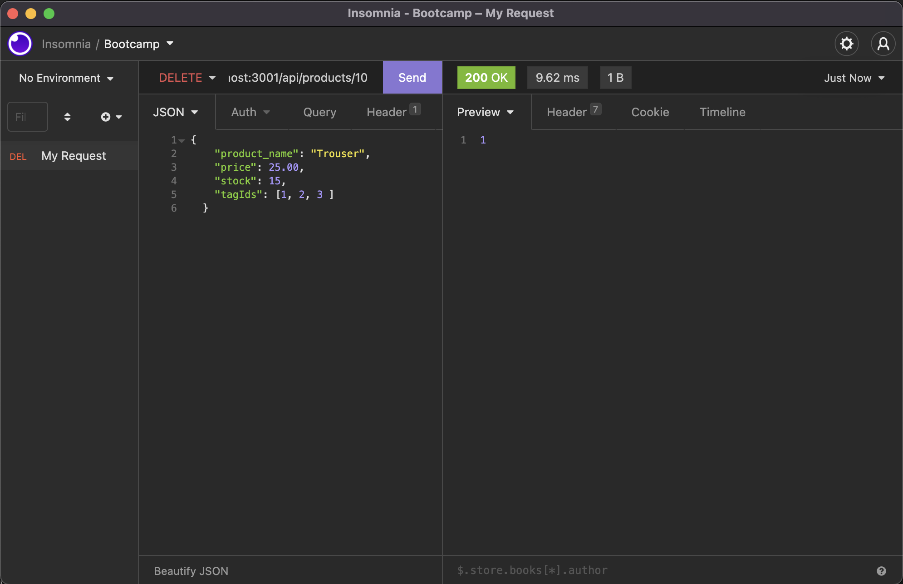
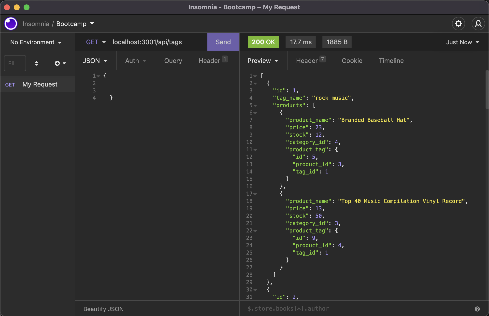
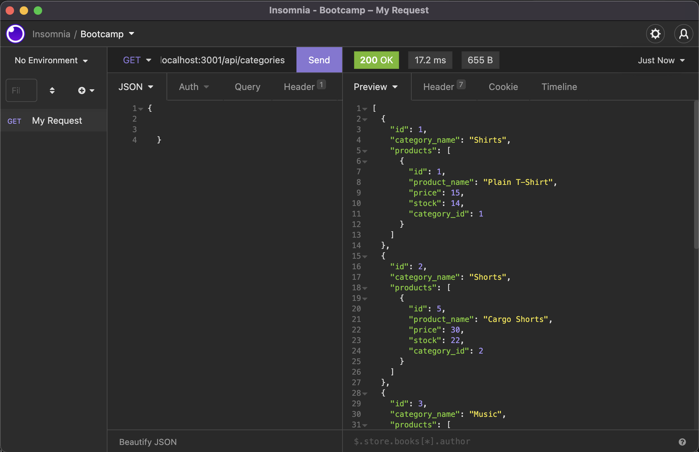

# <E-Commerce-Back-End.>

## Table of Contents
  * [Mission](#mission)
  * [User Story](#user-story)
  * [Parameters](#parameters)
  * [GITHUB page](#github-page)
  * [Demo Link](#demo-link)
  * [Screenshots](#screenshots)
  * [Any Questions?](#any-questions)

## Mission
    * to build the back end for an e-commerce site by modifying starter codes to support the web retail of the electronic industry
    * to configure a working Express.js API to use Sequelize to interact with a MySQL database
    * have a clean, polished and responsive user interface

## User Story
    
    As a Manager at an internet retail company, I want a back end for my e-commerce website that uses the latest technologies so that my company can compete with other e-commerce companies

## Parameters
    
    Given a functional Express.JS API;

    * when i add my database name, MySQL username, and MySQL password to an environment variable file,
        then I am able to connect to a database using Sequelize
    * when I enter schema and seed commands
        then a development database is created and is seeded with test data
    * when I enter the command to invoke the application
        then my server is started and the Sequelize models are synced to the MySQL database
    * when I open API GET routes in Insomnia for categories, products, or tags
        then the data for each of these routes is displayed in a formatted JSON
    * when I test API POST, PUT, and DELETE routes in Insomnia
        then I am able to successfully create, update, and delete data in my database
    

## GITHUB page

[Github](https://github.com/roman-ac/e-commerce-backend-by-roman-ac)

## Demo Link

[Walkthrough video](https://drive.google.com/file/d/1C8rCPULnd-yRTI7qaZpEFngMVDoLc5xT/view)

# Screenshots

  
  

  
  

  
  

  
  

  
  

## Any-Questions?
  ### Reach out here: 
  [roman-ac](https://github.com/roman-ac)  
  roman25xx@gmail.com
